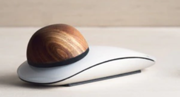
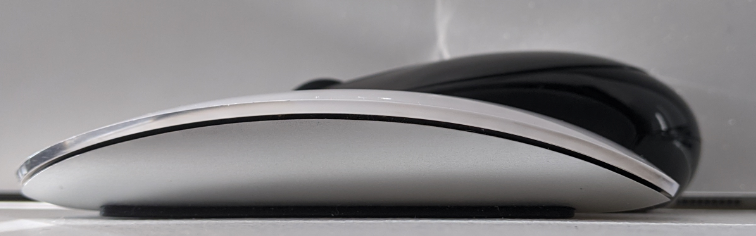
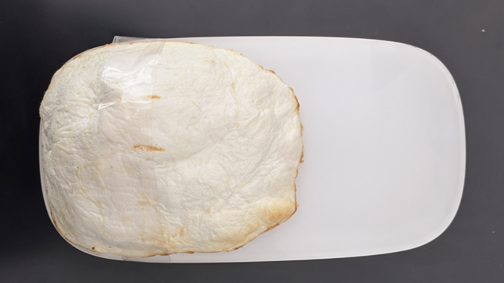
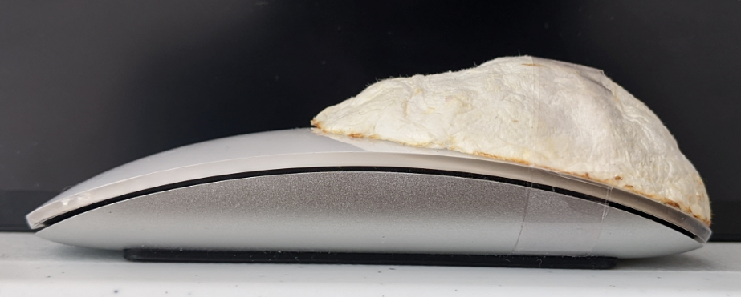
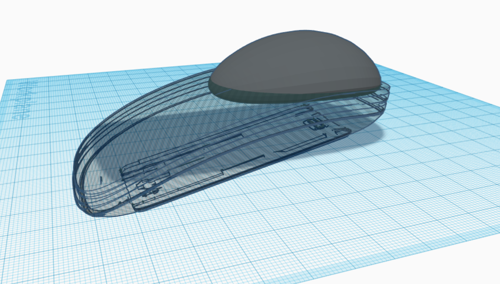
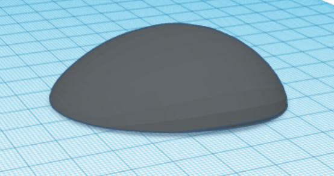
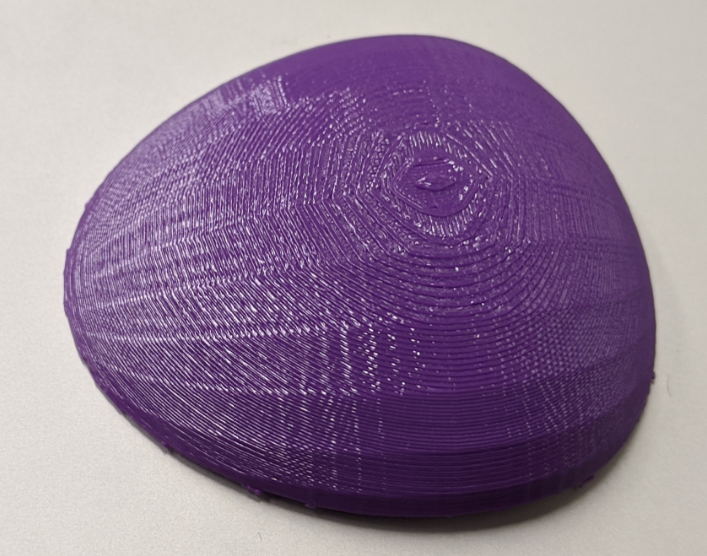
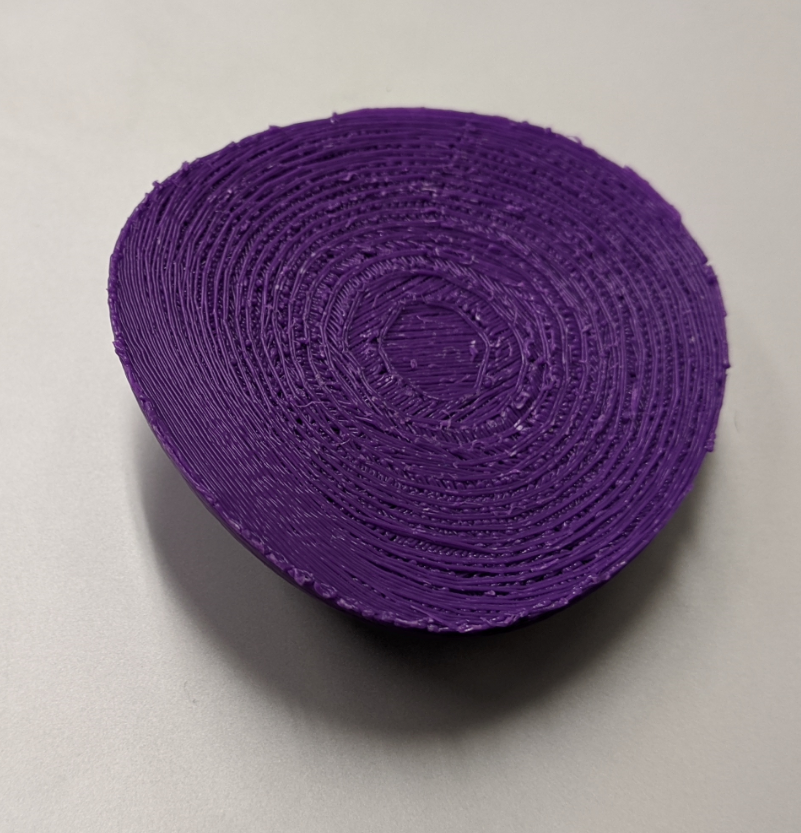
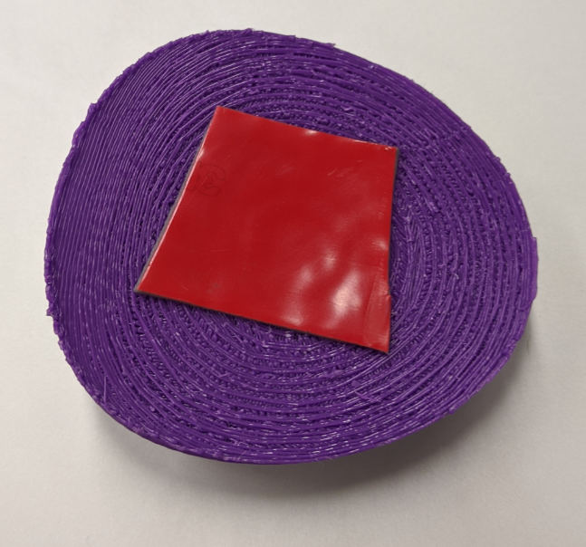
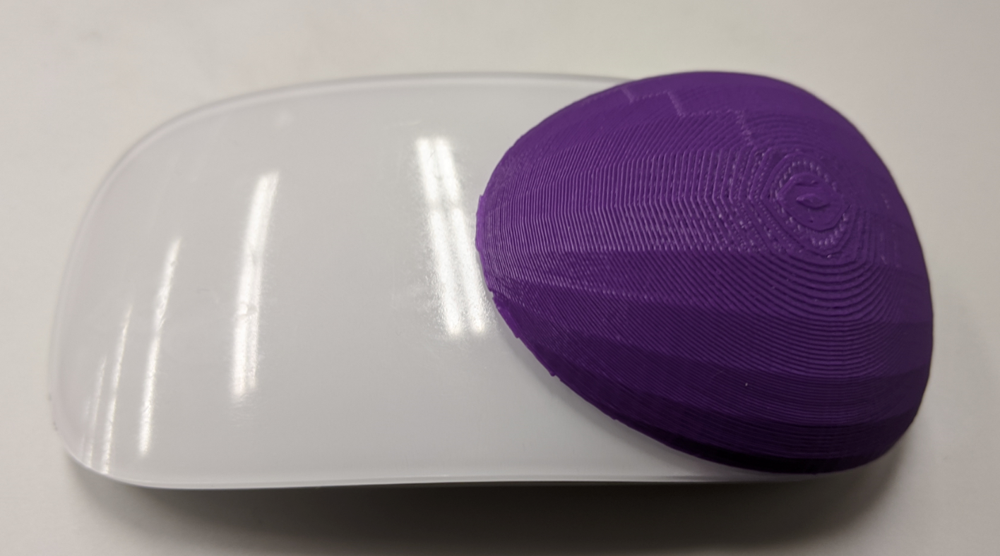

# 如何拯救苹果的鼠标

苹果的鼠标难用是世人皆知的。
最大的问题就是丝毫没有握感可言。
手持的姿势只能用捏的。
点按还算好，但是那个触摸滚轴真的是超级难用。
手指稍微出一点汗的话，在那个玻璃板上阻力就特别大，
轻轻一划，鼠标就跑掉了。

无意间，我在知乎上看到了这么个东西。

搜了下是个众筹项目，可惜只有两个人给钱，死在了第一轮。不过这个奇葩设计感觉不死都难。然而却让我萌生了一个想法。

## Idea

如果我能给苹果鼠标补一个屁股，是不是手感就能好一些呢？
上图的前面就是苹果的鼠标，后面是微软的鼠标。
合在一起看起来不错。

## Prototype

如果把一坨湿的卫生纸烤干，它就能变硬，这个是小时候很多手工的基础。
于是我按照这个道理做了个可以用的原型，用胶带贴上。

手感说实话还不赖，就是发现屁股不能太靠后，否则手掌压下去的时候可能会把鼠标翘起来。

## Design

我是一个超级不专业的Diyer。
3D建模这种事情直接用的TinkerCAD网页解决的。

首先找到一个现成的[苹果鼠标的模型](https://www.modelplusmodel.com/tech/electronics/f19-computer-mouse.html)。
然后捏一个蛋。
最后把蛋用鼠标削掉一半，就大功告成了。

## Print

因为底面是弧形的，打印的时候记得加support under bridge。
正反面分别是这样的。

反面比较矬，不过没事，反正是反面。

## Application

给反面贴上双面胶

然后直接贴在鼠标上就好了。

用起来棒棒的。

我以前还嫌苹果鼠标的触摸滚动慢，装上屁股后才发现，原来一个手指触摸是慢速滚动，两个是快速滚动。原来是以前实在太难使导致根本没发现。