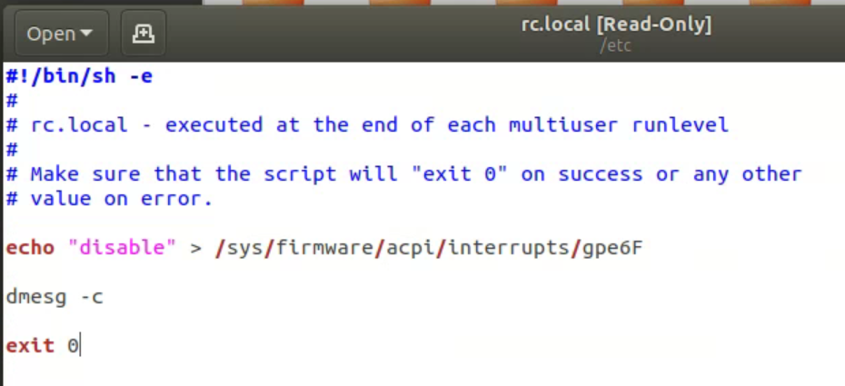

# Ubuntu 在 Z170 Pro4 主板上的 Kworker BUG

昨天挖坟挖出来一张PCIe的SSD大为惊喜，
于是顺手就装在了实验室的机器上，然后装了Ubuntu。
结果还是原来的问题，
就是总有一个线程被一个叫`Kworker`的进程给占满了。
当然很久以前就遇到过这个问题，
当时看了[这个博客](https://stackoverflow.com/a/26172452/7037749)，
解决方法是用root用户disable一个interuption什么的。
```bash
sudo -s
sudo echo disable > /sys/firmware/acpi/interrupts/gpe6F
```
据说还有一个开机自动运行的方法，但我当时没搞定。

之后我又看到了[这个博客](https://askubuntu.com/a/421916),
里面的什么traceback我试了，
差点每把我系统窗给炸了。
目前除了知道用
`sudo dmesg -c`删记录以外，
还不知道怎么取消这个traceback。

另外一个纳闷的事情是，
不管是什么时候，装什么版本的Ubuntu，
这个错误永远都是一样的。
所以我猜是和硬件有关，
最终我找到[这篇](http://jhshi.me/2015/11/14/acpi-error-method-parseexecution-failed-_gpe_l6f/index.html#.XjyNqGhKhyx)，
这个人的错误代码也是一样，
仔细看，我们的主板是一样的。
这么看来，这个错误应该是主板上的。
根据这个人的折腾记录，
虽然应该是一个BIOS问题，
然而并不能通过BIOS解决，
最后还是通过disable中断解决的。
并且还给出了开机后自动disable的方式，
应该是和我很久之前看到的没有区别。
于是我照猫画虎地也做了一个文件，
里面只包含他提到的一行代码。
然后木有任何效果。

我再去查了这个rc.local的文件用途，
好像是在开机时用root权限执行一些初始化设定。
于是查到[一篇文章](https://unix.stackexchange.com/questions/49626/purpose-and-typical-usage-of-etc-rc-local),
里面说要有一个header和return 0。
我照做了，得到这么一个文件

可惜，还是木有任何效果。

最后右键properities发现，
有个属性叫做

是空的，
怪不得开机不运行，
原来写完保存后只是一个纯文本。
查了如何set excutable
照着[这个网页](https://howtoubuntu.org/how-to-execute-a-run-or-bin-file-in-ubuntu)
```
sudo chmod +x rc.local
```
重启之后终于没再看见那个`Kworker`进程。
可喜可贺。

## 后话

再之后的计划就是把这个机器设上一个远程访问。
目前Chrome Remote 凑活能用。
估计VPN什么的，就等什么时候再等JJ来教我了。