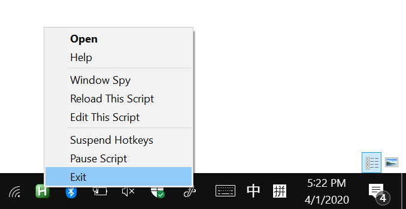

# 苹果鼠标的环形滚动 Circular scrolling for Apple Mouses 
本AHK脚本意在在苹果的鼠标上模拟iPod Clickweel一般的环形滚动效果。
支持Mighty Mouse和Magic Mouse 1和2。
可惜AHK只支持Windows。

This AHK script aim to replicate the feel of iPod Clickwheel on Apple Mouses。
It support Mighty Mouse and Magic mouse 1 & 2.
Saddly AHK only supports Windows, and you know what does that mean.

# 使用说明
步骤
1. 首先你需要下载安装[AutoHotKey](https://www.autohotkey.com/)。
2. 然后下载脚本：
    - [平滑滚动](clickwheel_smooth.ahk)，但是只在Chrome等少数软件中有效
    - [模拟滚轮](clickwheel.ahk)，全局可用，但没那么平滑
3. 双击可以运行脚本
4. 在系统托盘处右键可以关闭脚本
    

How to use
1. Download and install [AutoHotKey](https://www.autohotkey.com/).
2. Download one of the version of the script:
    - [smooth scrolling](clickwheel_smooth.ahk), only works in some app like chrome
    - [mimicing wheel](clickwheel.ahk), works universally but not smooth.
3. double click to run the script
4. derminate the script in system tray
    

# 故事

iPod可以说我是童年中最美好的回忆。
特别特别喜欢那个clickwheel滚轮。
可以一直滚一直滚，即使是一个很长很长的进度条或者歌单
可以不间断地从头滚到尾。
谜之带感，不能自拔。

我无数次幻想苹果能把clickwheel用在鼠标上。
然而十多年了，
苹果你看看你都出了些啥？ 
那么就只能自己动手丰衣足食了。

我手上有一只和iPod同年代的苹果Mighty Mouse
和一只1代的Magic Mouse
这两个鼠标都有四向滚轴。
可以用来模拟划圈圈。
啊对，如果你对那个紫色的屁股感兴趣，
可以看我之前的博客，手感真的棒棒哒。

那如何把旋转的动作转换成滚动呢？
这就需要一个能够对鼠标行为做手脚的软件。
因为我对所有叫什么精灵的软件都有种不信任感。
所以我使用的是Auto Hot Key，简称AHK， 

首先我先写了一个简单的AHK脚本用于采集数据。
然后用采集的数据在matlab里做仿真。
摸索出比较可行的算法以后，
就可以把matlab的带码改写成AHK的代码。

运行起来丝般顺滑！
特别是Mighty Mouse的那个哒哒声，
和ClickWheel简直如出一辙。