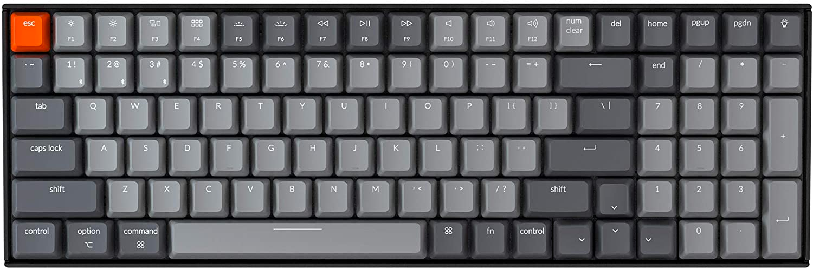

# 如何降伏一把 Keychron K4 Mac Windows 双模机械键盘

购置一把顺心的机械键盘是一个非常重要的事情，
这个我在前篇《台式电脑配件推荐，工作学习篇》里有提到过。
当时提到说打算换一把 Box 白轴的键盘，
于是之后买了一把 Keychron K4。
已经使用了几个月。
一开始有很多难受的地方。
中间经过各种调教，
终于达到我较为满意的样子。
我就把我的调教经验分享给大家。
调教的过程分为不同的方面，
我会分开讨论，
大家可以按需所取。

# 结论放在最前面

硬件
- 轴体全换成 Box 白
- 键帽垫双层橡胶圈
- 改变方向键键帽安装角度

Windows 改键
- 用 SharpKeys 和 AHK 在 Windows 上实现类似 Mac 上 Cmd 系的快捷键
- 用 AHK 保持 num lock
- 用 SharpKeys 修改 home, end, 和 del 的位置

Mac 改键
- 用 Karabiner-Elements 修改 home, end, 和 del 的位置

# 按键手感篇

Keychron K4 的自带键轴可能是我用过的手感最诡异的。
购买的时候，我选的是 Clicky（嘎嘣脆）手感的 GATERON BLUE。
它的问题就是，按下的过程中居然有两个会咔哒的点：
除了在大概2mm处的触发点以外，最开始的0.5mm处居然也会咔哒一下。

不过这也算是在我的计划之中的，
当时就是冲着热插拔键轴才买的 Keychron K4，
所以立刻就全数换成了 Box 白轴。
怎么说呢，那个感觉简直就是，相见恨晚。
Box 轴的稳定性真的是相当的好，
咔哒的也非常干脆，
我让我再回到 cherry 青轴我是打死也不回去。

另外就是橡胶圈。
机械键盘的声音其实有三下。
第一下是轴体触发时的声音，
第二下是按键打击底板的声音，
第三下是按键回弹到头打击上板的声音。
其中其实只有第一下是令人愉悦的，
另外两声我希望能够削减掉。
第三下因为发生在轴体内部，所以无解。
而第二下是可以通过橡胶垫圈来减小的，
然而 KeyChron 家的键帽有些特别，
一个垫圈不够，要垫两个垫圈才能阻止打板。

# 在 Windows 上实现 Mac 快捷键

因为我是 Windows + Mac 用户，
所以我希望两个系统下的快捷键能够尽可能一致。
相比之下我认为 Mac 的快捷键设置更合理，
于是我花了一些功夫将 Mac 上常用的快捷键移植到了 Windows 上。
如果你不是 Mac 用户，可以跳过这个部分。

## Ctrl vs CMD

Mac 的 CMD 键比 Window 的 Ctrl 键好用太多了。
如果你是一个 Mac + Windows 用户，
那么你肯定知道我在说什么。
不是因为功能上的差别，而是位置。
CMD 键的键位是用左手大拇指来按的，
所有相关的快捷键都可以用左手大拇指加食指完成。
然而 Windows 的 Ctrl 按键，
就一言难尽了。
我一般都是用左手小拇指去够，
然而这个姿势非常的别扭。
用过了这个 CMD 键之后，
就特别恨这个 Ctrl 的位置。

这时就用到了改键软件 SharpKeys。
在这个软件里面，可以方便地修改注册表，改变按键的定义。
CMD 键的位置对应 Windows 的 Alt 键。
这个键的地位其实很低，远远低于 Ctrl 键。
所以干脆就把 Alt 换成 Ctrl 键。
但是 Alt 键又不能没有，
所以我就把目光转向了Caps Lock键。
这个键在键盘上占据了重要的位置却完全没有任何用处。
于是我就把 Caps Lock 键改成了 Alt 键。
这样一来，所有的 Ctrl 系快捷键就可以用 Mac 里 CMD 系快捷键同样的指法去按了，
解放了左手的小拇指。

## Alt-Tab

这时你可能会发现，
有一个重要的 Windows 快捷键被干掉了，
那就是 Alt-Tab，在 Mac 的对应快捷键是 CMD-Tab。
从原有键位上看，指法是一致的。
现在 Alt 键被搬走了，岂不就不一致了。

这时可以祭出第二个杀手软件 AHK。
在 AHK 里，可以将 Ctrl-Tab 映射到 Alt-Tab 上。
这样 Alt-Tab 的指法就又回到了原来的位置。

然而这还不算完。
Ctrl-Tab 本来是有用的，
就是在浏览器内部切换 Tab 之用,
在 Windows 和 Mac 上都有这个快捷键。
现在 Ctrl-Tab 被 Alt-Tab 占用了，有没有什么办法把 Ctrl-Tab 原先的功能保留呢？
确实是有的。
首先，键盘上的 Ctrl 和 Alt 其实是分左右的。
如果将 LAlt 改成 RCtrl，
然后将 RCtrl-Tab 映射到 Alt-Tab，
并不影响原先的 LCtrl-Tab。
这样就可以在 Windows 里完美复现 Mac 上 CMD-Tab 和 Ctrl-Tab 的功能。

## Alt-F4

还有一个被干掉的重要快捷键是 Alt-F4。
其实我对这个快捷键颇有意见，
两个键相距太远，
即使用大拇指也难以优雅地够到。

在 Mac 里相对应地快捷键是 Ctrl-Q。
这个快捷键一般不会被 Windows 占用，
所以就在 AHK 中将 RCtrl-Q 映射成 Alt-F4。
这样退出程序的快捷键也和 Mac 统一了。

# 键盘布局

关于键盘布局短的结论是，如果你能买到 Hotswap 的 K10，K8 或者 K2, 就不要买 K4。

因为我对小键盘有一定的需求，所以当时在 K10 和 K4 之间选，
一个是桌面空间有限，
再一个是 K10 的 Hotswap 在亚马逊无货，
所以一狠心买了一把 K4。
用起来才发现这个布局在很多地方真的非常难受。
不夸张的讲，K4 简直是 KeyChron 系列里面布局槽点最多的一个型号。

## 方向键
第一个让我难受的地方就是这个方向键的排布，
和其他按键完全融为一体了。
市面上几乎所有的键盘，
不论是独立的还是笔记本的，
几乎都把方向键的周围隔出一个区域，
为的是在盲打的时候，
只凭手指触感就可以快速定位方向键。
然而 K4 这个一马平川的设计，
完全就没有任何的触感反馈，
就算真的凭借肌肉记忆摸到了方向键，
也没有任何踏实的感觉。

经过各种尝试，
我最终发现，改变键帽的安装方式可以非常优雅地解决这个问题。
那就是将除了下键以外的其他三个键帽换一个角度安装，
使得三个按键向下键倾斜。
这样不仅改变了方向键的手感，
而且因为四个按键向中间聚拢，
方向键和其他按键的距离也稍微远了一些。

## 毒瘤 Ins 和 Num Lock
要说键盘上最没用的按键，
Caps Lock 其实远远算不上第一。
最最没用，甚至有副作用的按键其实是 Ins。
我不知道 21 世纪都过去五分之一了，
还有什么软件要依靠 Ins 键运行。
而且 Caps Lock 好歹还有个指示灯，
Ins 的状态完全就是猜谜，
经常就是偷偷摸摸地给我搞事情。

K4 的布局再烂，好歹知道把 Ins 这个毒瘤拿掉，
可是别忘了还有一个问题，
小键盘在 Num Lock 不亮的情况下，
Numpad 0 键可以用作 Ins。

为了防止宇宙被破坏，
我找到了这么一行 AHK 代码，
可以保证 Num Lock 始终是亮的。
这样 Ins 的问题才算是彻底解决。

在这个问题上，
Mac 其实早就有解决，
在 Mac OS 下, num clear 这个按键的作用就是回到数字输入，
按多少遍都是，
所以 Ins 的问题基本就原生地解决了。

## del 键
我用 del 键的次数其实非常多。
在一般按键布局里，
del 要么在独立的孤岛里，
要么就是在 Backspace 的右上方。
而 K4 上居然破天荒地放在了 BackSpace 的左上方，
而且右上方居然是会移动光标位置的 Home 键。
按 Del 时误触 Home 的话就全乱套了。

所以再次祭出大杀器 SharpKeys。
将按键调整成了下面这个布局。

因为 num lock 这个按键没有什么用处了，
所以随便一放，
正好可以留出位置，
把 Home 和 end 放在相对合理的位置。

在 Mac 里 也可以用 Karabiner-Elements 将按键调整到同样的布局。

# 后记
经过一番调教，
目前已经用了很久了，
还比较满意。
如果您有需要，
也可以自取所需的部分。