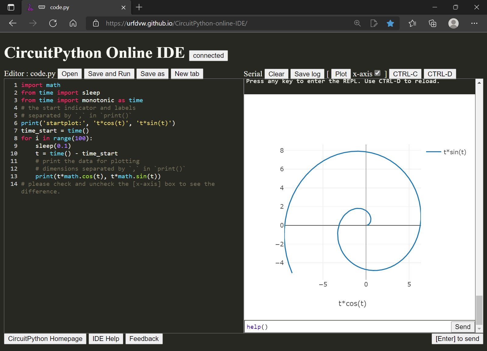

Hi everyone

In this video, I want to share some new features about the CircuitPython Online IDE.

If you don't know, CircuitPython is the python language for microcontrollers. It is developed by Adafruit.

And this website is an online IDE for developing CircuitPython projects. It is very convenient because you don't need to install it. Just visit this link, and you can start working. The links to this IDE and also CircuitPython official site are in the video description below.

The 1st new feature is the help information. If you hover your cursor over any button, a piece of text will appear telling you what this button does. For example, if my cursor hovers over this [Save and Run] button, it will tell you that this will save, and a run will be triggered automatically.

Another new feature is the plot function. If you are using sensors in your project, this will be super helpful. Let see how to use it. When I hover my cursor over this button, it tells me this button will show or hide the figure. And about how to plot, let see the IDE help.

Let's scroll down, and here are some information. Now I will explain to you how it works by this example code.

[open a project and copy and paste code]

In this example, we want to plot `t*cos(t)` and `t*sin(t)`. The `startplot:` is an indicator telling the IDE that we are plotting. And in the same line, we want to print out the name of the signals. Inside the python print function, these are separated by commas. In the for-loop, we print out the values and separate them by commas.

If we want to see this plot in action, we can first click on the button to show the plot, and then [save and run]. Now you see that the signals are plotted in real-time.

In the plot, the legends are shown on the right. You can also check the values, zoom in and out, and move.

If you want to use the first dimension as the x-axis, check this box. Now you see that this t*cos(t) is used as the x-axis. Let's run that again. Very pleasant to look at.

If you find this useful, please consider subscribing. And see you in the next video.

