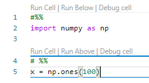
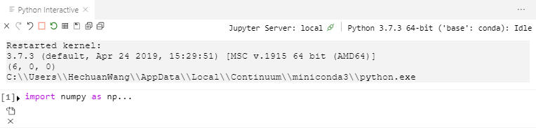
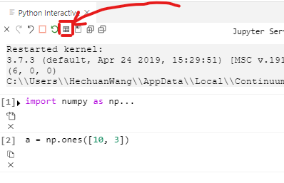
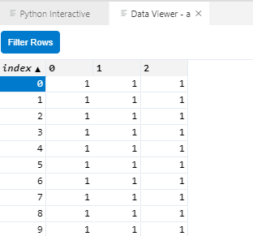
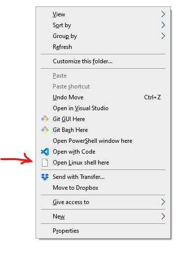

# Python科学运算环境搭建

## 背景
作为一个前Matlab玩家，我表示Matlab的IDE绝对是所有科学计算IDE的始祖，而且绝对是最好的一个。像R的RStudio，Python的Spyder和Redo，都是力求在自己的语言里复制出Matlab IDE的手感。Python IDE有非常多，然而很少有能够包含所有我所寻找的功能的。

我要寻找的科学计算的功能主要是以下这些，当然Matlab IDE的功能远不止这些，然而最关键最常用的就是这些：
- 一个漂亮的文本编辑器，要autocompletion和关键字高亮
- 一个变量查看器，需要的时候能够在表格里面现实数据
- 一个interactive窗口，不是terminal
- debugger，断点调试
- 如果又工程管理就更好了，最好还是有Git的那种

那么在Python界哪一个IDE能最好的还原Matlab的手感呢？Surprisingly，是VSCode!

## 工作流程
关于文本编辑器，工程管理，Git本来就是VScode的看家本领，不必多说，必然是棒棒的。然而能让VScode成为最好的科学计算IDE，最大的功劳是Interactive窗口的引入。VScode本来就可以运行.py文件，但如果在代码中加入分段符```#%%```，就可以看到下面这个菜单



如果按```Run Cell```就会出现一个窗口如下



其实就是打开了一个jupyter notebook。这个窗口的最下面还有一个可以输入的地方，方便输入一些即时的代码段。


和notebook一样也是Shift + Enter运行输入的代码。这样Python Interactive窗口的用法，就和Matlab的Command窗口的用法完全一样了。 



在最上面这个工具栏里面，有这么一个按键，点击可以打开变量查看器。


如果是nparray的话，后面会显示一个小按键，点击可以在表格里查看变量。



如果在最下面的cell按```Run above```或者在最上面的cell按```Run Below```就相当于运行全部代码。如果需要调试还可以按```Debug Cell```。如果你想把输出结果存下来，还可以按工具栏中的保存按键把interactive里面的全部内容保存成一个Notebook文件。而且因为是Notebook，所有的绘图功能也都集成在了interactive里面。

这样一来，我想要的MatLab的全部主要功能就都集齐了。

## Linux 和 远程
如果说只是要上面说的这些功能，其他的IDE比如说PyCharm，Spyder也都能磕磕绊绊地完成。但是VScode还集成了一个了不起的功能，就是SSH，捎带着还支持WSL。

首先是这个SSH，安装过插件之后，登陆远程的主机，在vscode上操作远程的机器就和操作本地的机器完全一样。

WSL是微软开发的自家的Linux模拟器。非常轻量，比起VMware或者VirtualBox要小很多。而且对windows支持的好太多。比如在工作的文件夹下面Shift加右键，就能看到这菜单



可以直接在Linux terminal里打开这个dir。之后键入命令```code .```就可以用Vscode通过WSL打开这个文件夹。

虽然我用的是Linux虚拟机里面的Python，但是用的IDE是在Win10里安装的VScode，操作的文件也是Win10里面存放的文件。

这样一来，无论是远程服务器，还是本地虚拟机，我都可以用完全一样的方式工作。是不是很妙。