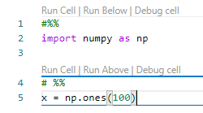
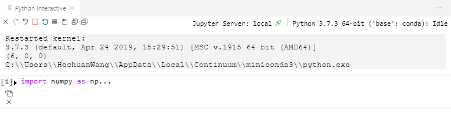
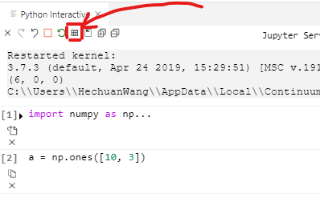
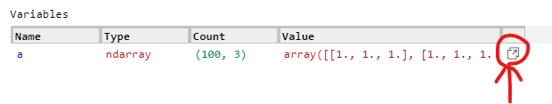
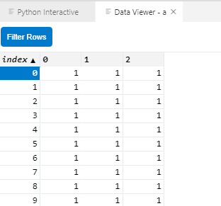
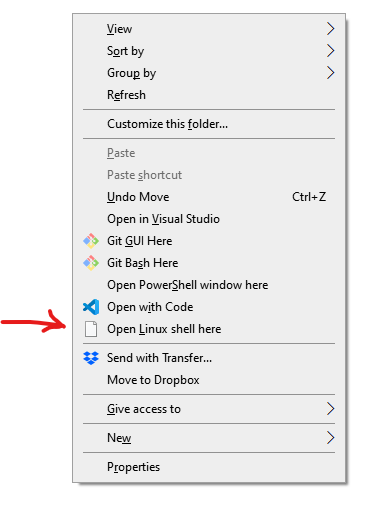

# Python界最好的科学计算IDE居然是它？
*万恶的营销号标题*

## 背景
作为一个前Matlab玩家，我表示Matlab的IDE绝对是所有科学计算IDE的始祖，而且绝对是最好的一个。像R的RStudio，Python的Spyder和Redo，都是力求在自己的语言里复制出Matlab IDE的手感。Python IDE有非常多，然而很少有能够包含**所有**我所寻找的功能的。

我要寻找的科学计算的功能是以下这些：
- 漂亮的文本编辑器，要autocompletion和关键字高亮（Matlab的Editor）
- 变量查看器，需要的时候能够在表格里面现实数据（Matlab的Workspace）
- interactive窗口，不是terminal（Matlab的Command）
- 工程管理，最好还是有Git的那种（Matlab的Current Folder）
- 比较正常的绘图功能
- debugger，断点调试

当然Matlab IDE的功能远不止这些，然而最关键最常用的就是这几个。那么在Python界哪一个IDE能最好的还原Matlab的手感呢？Surprisingly，是VSCode!

## VScode + Python 的工作流程
至于文本编辑，工程管理，Git本来就是VScode的看家本领，不必多说，必然是棒棒的。如果作为普通的Python IDE，在terminal里进行运行和调试，也是不在话下。然而能让VScode成为最好的**科学计算**IDE，主要归功于Python Interactive窗口的引入。

如果在代码中加入分段符```#%%```，就可以看到下面这个菜单



如果按```Run Cell```或者键盘上的 Ctrl + Enter 就会打开Python Interactive窗口。



如果在最下面的cell按```Run above```或者在最上面的cell按```Run Below```就可以运行全部代码。

Python Interactive的本质是一个jupyter notebook。而且因为是Notebook，所有的绘图功能也都集成在了interactive里面。除了运行Editor里面的code cell，这个窗口的最下面还有一个可以输入代码的地方，方便输做一些即兴的运算和绘图。


这样一来，Python Interactive窗口的用法，和Matlab的Command窗口的用法是一样的。 

在最上面这个工具栏里面，有这么一个按键，点击可以打开变量查看器。



如果是nparray的话，后面会显示一个小按键，



点击可以在表格里查看变量。



如果需要调试还可以按```Debug Cell```，只不过这个Debug是在terminal里面运行的，不在Interactive里。

这样一来，我想要的MatLab的全部主要功能就都集齐了。

## 远程和Linux虚拟机
VScode的另外一个非常重要的功能就是SSH，捎带着还支持Win10 WSL虚拟机。

用VScode的SSH插件登陆远程的服务器后，所有的操作都和在本地完全一样。

WSL是微软开发的自家的Linux模拟器。优势之一是没有graphic，所以节省了很多运算资源。另一个优势是和Win10合作地非常好。

比如在一个Win10文件夹下面Shift+右键，就能看到这菜单



可以直接在Linux terminal里打开这个dir。之后键入命令 ```code .``` 就可以用Win 10 里安装的Vscode通过WSL打开这个文件夹。虽然我用的是Linux虚拟机里面的Python，但是用的IDE是在Win10里安装的VScode，操作的文件也是Win10里面存放的文件。

这样一来，无论是远程服务器，还是本地虚拟机，我都可以用完全一样的方式工作。是不是很妙。

## 下载和安装
上面这些功能的安装其实非常的简单，**而且还免费**。我个人还是喜欢用Win10的，如果非得用Linux的话我就用WSL。可惜WSL不支持CUDA，不过我还是可以SSH进系里带GPU的Liunx服务器。

所以首先需要用安装包安装Win10下面的VScode。安装包什么的最简单，而且可以方便地在右键菜单里加入“Open with Code”的选项。
- [Windows VScode 安装包下载地址](https://code.visualstudio.com/)

### 纯Win10工作环境
下载Win10的Anaconda安装包，安装后就可以直接工作了。
- [Anaconda 安装包下载地址](https://www.anaconda.com/distribution/#download-section)

### Win10 WSL工作环境
首先需要打开Win10的WSL功能，并且安装一个Linux distribution，主要需要看下面这两个页面
- [打开Win10的WSL功能](https://code.visualstudio.com/remote-tutorials/wsl/enable-wsl)
- [安装Ubuntu](https://code.visualstudio.com/remote-tutorials/wsl/install-linux)

然后还是安装Anaconda，不过需要下载Ubuntu的版本。从下载文件夹里面Shift+右键，点击"Open Linux shell here"，然后按照Anaconda的说明安装就好了

- [Anaconda 安装包下载地址，记得选Liunx](https://www.anaconda.com/distribution/#download-section)
- [Anaconda 在 Ubuntu 下的安装教程](https://conda.io/projects/conda/en/latest/user-guide/install/linux.html)

在VScode里安装WSL插件。第一次在WSL上运行Python的时候VScode会提示没有Python插件，点yes安装就好了。
[安装VScode的WSL插件](https://code.visualstudio.com/remote-tutorials/wsl/getting-started)

### SSH 工作环境
要用SSH，首先你得有一个服务器，这个会差别很大，我就不瞎说了。在VScode这边基本上也就是一个插件解决的。更多的信息就要问设服务器的哪一方了。
- [安装SSH插件，想看更多的话就点“下一步”吧](https://code.visualstudio.com/remote-tutorials/ssh/getting-started)

### *Anaconda vs Miniconda
我是用不到Anaconda里面那么多工具啦，所以一般安装的是Miniconda，就是barebone版本的Anaconda。安装之后要在conda里手动安装需要的package。另外，如果需要在表格里显示变量这个功能，得安装Numpy和Pandas，不过做科学计算的话这两个库都是一定会安的吧。
- [Miniconda 安装包下载](https://docs.conda.io/en/latest/miniconda.html#)